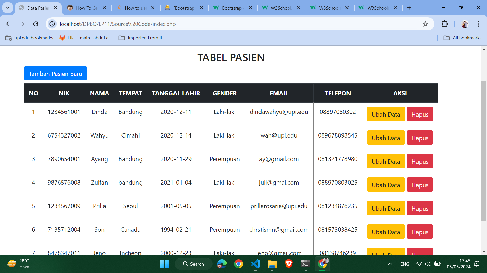

# Latihan Praktikum 11 DPBO 2024

## Janji

Bismillah
Saya Themy Sabri Syuhada dengan NIM 2203903 mengerjakan Latihan Praktikum 11
dalam mata kuliah Desain Pemrograman Berorientasi Objek untuk keberkahanNya maka saya tidak melakukan kecurangan seperti yang telah dispesifikasikan. 
Aamiin

## Deskripsi Program

Program ini merupakan program untuk mengelola data pasien. Program ini menerapkan arsitektur MVP (Model View Presenter) dalam pembuatannya. Terdapat fitur CRUD standar untuk menambahkan data pasien baru, mengedit data pasien lama, menghapus data pasien, dan menampilkan data pasien dalam bentuk tabel.

## Alur Program

1. Create (Buat): Pengguna memasukkan data baru melalui antarmuka pengguna (UI) atau melalui permintaan API. Data tersebut dikirim ke server aplikasi.
2. Read (Baca): Aplikasi membaca data dari database MySQL berdasarkan permintaan pengguna atau operasi tertentu. Data yang diminta dikirim kembali ke pengguna atau digunakan dalam operasi selanjutnya.
3. Update (Perbarui): Pengguna memperbarui data yang sudah ada melalui UI atau API. Aplikasi menerima permintaan perubahan, memvalidasi input, dan kemudian mengirimkan perintah SQL untuk memperbarui data terkait di database MySQL.
4. Delete (Hapus): Pengguna menghapus data yang tidak diperlukan lagi melalui antarmuka pengguna atau API. Aplikasi menerima permintaan penghapusan, memvalidasi apakah pengguna memiliki izin yang sesuai, dan kemudian mengirimkan perintah SQL untuk menghapus data dari database MySQL.

## Preview Program

